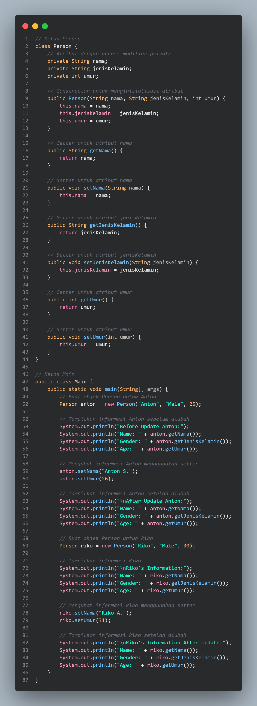

# Pemograman-Orientasi-Objek_latihan3

## `Nama : Agus Setiawan Nim : 312310597 Kelas : TI.23.A6`

 

# Soal

 

 

# Jawaban

### Kode

 

<a href=https://github.com/AgusSetiawn/Pemograman-Orientasi-Objek_latihan3/blob/main/Dokumentasi/Kode%20Java/Main.java><strong><i>Salin Kode</i></strong></a>

 

### Output

 

 
